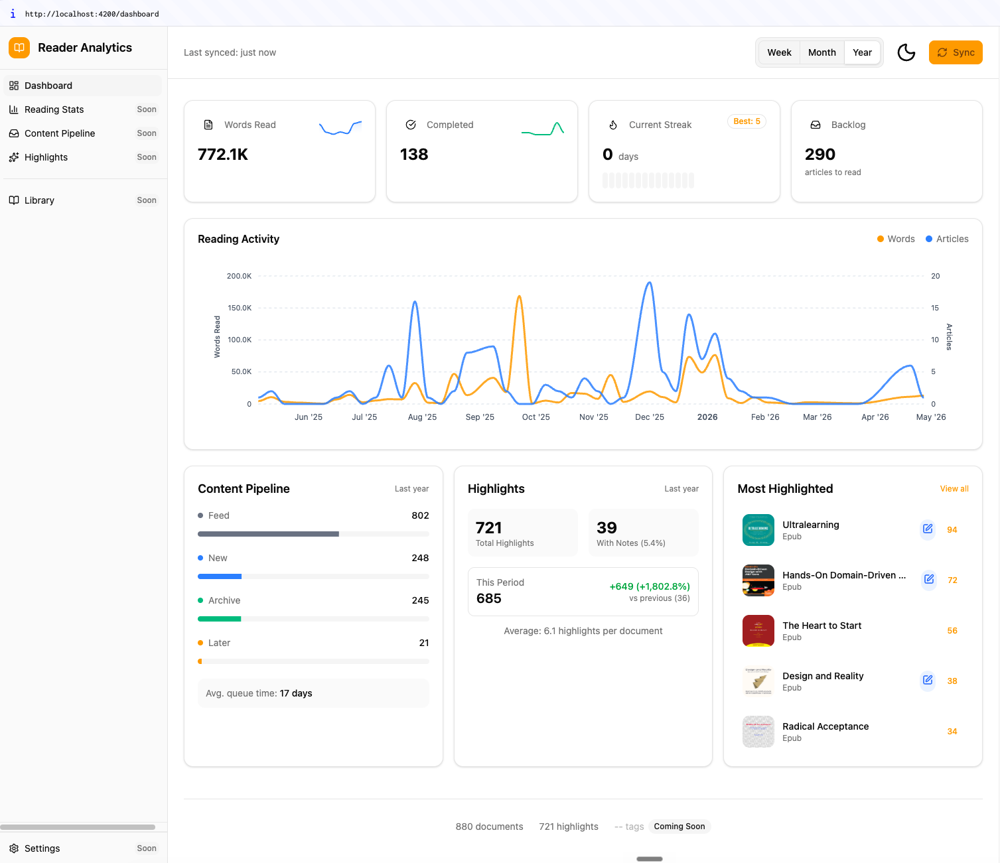
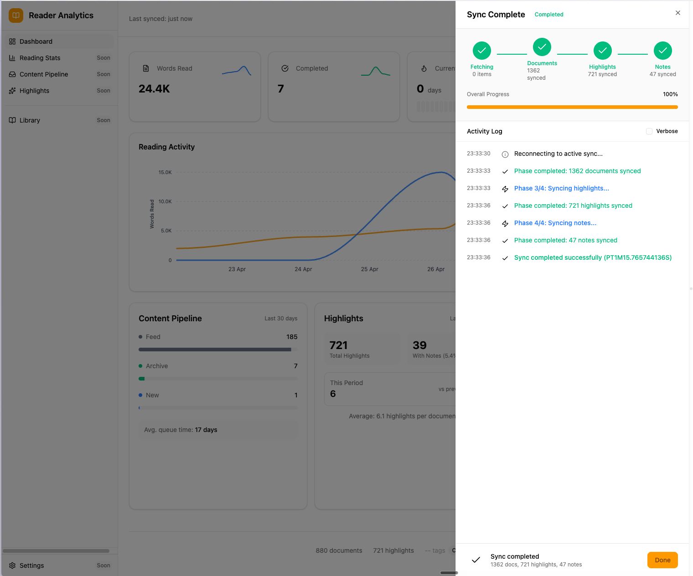

# Readwise Reader Analytics

Analytics dashboard for your Readwise Reader library. Syncs documents, highlights, and notes from the Readwise API and surfaces reading insights.

## Screenshots

### Dashboard


### Sync Progress


## Quick Start

### Docker (Full Stack)

```bash
# 1. Copy environment config
cp .env.sample .env
# Edit .env — set READWISE_API_TOKEN from https://readwise.io/access_token

# Start everything with hot-reload
docker compose -f docker-compose.dev.yml up --build

# With auto-rebuild on backend changes
docker compose -f docker-compose.dev.yml watch
```

### Manual (Separate Terminals)

```bash
# 1. Copy environment config
cp .env.sample .env
# Edit .env — set READWISE_API_TOKEN from https://readwise.io/access_token

# Backend
cd backend && docker compose up -d
./gradlew bootRun --args='--spring.profiles.active=local'

# Frontend
cd readwise-analytics
bun install && bun run start
```

Backend: http://localhost:8080 | Frontend: http://localhost:4200

### Hot Reload Behavior

| Component | Reload | Mechanism |
|-----------|--------|-----------|
| Frontend | Instant | Volume mount + Angular HMR |
| Backend | Container rebuild | `docker compose watch` |

## Architecture

Event-driven bounded contexts with clean separation:

```
Sync Context → publishes events → Library, Tracking contexts → Analytics queries
```

| Context | Purpose | Key Entities |
|---------|---------|--------------|
| Sync | Readwise API integration, async orchestration | SyncRun, SyncPhase, SyncCursor, SyncProgressEvent |
| Library | Document storage | Document, Highlight, Note, Tag |
| Tracking | Progress time-series | ReadingProgressSnapshot, LocationChange |
| Analytics | Query-time metrics | Projections via PostgreSQL |

```
                    API Layer
                  SyncController
                        |
                        v
             Sync Bounded Context
   +---------------------------------------------+
   |  Domain        Application    Infrastructure|
   |  - Events      - Orchestrator - Readwise API|
   |  - Entities    - Executor     - SSE Emitter |
   |                - Stores       - JPA Repos   |
   +---------------------+-----------------------+
                         | publishes
                         v
             +-----------------------+
             |  DocumentSyncedEvent  |
             |  HighlightSyncedEvent |
             +-----------+-----------+
                         | subscribes
             +-----------+-----------+
             v                       v
    Library Context           Tracking Context
   +------------------+      +------------------+
   | - Document       |      | - ProgressSnap   |
   | - Highlight      |      | - LocationChange |
   | - Note           |      | - TrackingStore  |
   | - Tag            |      +------------------+
   +------------------+              |
             |                       |
             +-----------+-----------+
                         | queries
                         v
                Analytics Context
             +------------------------+
             | - AnalyticsService     |
             | - AnalyticsStore       |
             | - PostgreSQL queries   |
             +------------------------+
                         |
                         v
                   API Layer
              AnalyticsController
```

## API Endpoints

### Sync

| Method | Path | Description |
|--------|------|-------------|
| POST | `/sync` | Trigger async sync (returns syncId immediately) |
| GET | `/sync/{syncId}` | Poll sync status |
| GET | `/sync/{syncId}/stream` | SSE stream of sync progress events |
| GET | `/sync/active` | Check if sync is running |
| DELETE | `/sync/{syncId}` | Cancel running sync |
| GET | `/sync/history` | Past sync runs |

### Analytics

| Method | Path | Description |
|--------|------|-------------|
| GET | `/api/analytics/dashboard` | All dashboard metrics |
| GET | `/api/analytics/reading/stats` | Time-series reading data |
| GET | `/api/analytics/reading/streak` | Current and longest streak |
| GET | `/api/analytics/reading/peak-hours` | Hourly activity distribution |
| GET | `/api/analytics/pipeline` | Content pipeline metrics |
| GET | `/api/analytics/highlights` | Highlight statistics |

### Drill-down

| Method | Path | Description |
|--------|------|-------------|
| GET | `/api/analytics/drill-down/words-read` | Words-read drill-down (cursor) |
| GET | `/api/analytics/drill-down/completed` | Completed-docs drill-down (cursor) |
| GET | `/api/analytics/drill-down/backlog` | Backlog drill-down (cursor) |

### Documents

| Method | Path | Description |
|--------|------|-------------|
| GET | `/api/documents/{id}` | Document detail with highlights/notes |

Query params: `startDate`, `endDate` (ISO format), `granularity` (DAILY/WEEKLY/MONTHLY)

## Tech Stack

| Layer | Technology |
|-------|------------|
| Backend | Kotlin 2.2, Spring Boot 4.0, PostgreSQL 16, Hibernate 7.1 |
| Frontend | Angular 21, Tailwind CSS 4, Spartan UI, ApexCharts |
| Tooling | Gradle, Bun, GraalVM Native Image |

## Project Structure

```
├── backend/              # Spring Boot 4.0 + Kotlin
│   └── src/main/kotlin/com/reader/analytics/
│       ├── api/                    # REST controllers + DTOs
│       ├── sync/                   # Sync bounded context
│       │   ├── domain/             # SyncRun, SyncPhase, events
│       │   ├── application/        # SyncOrchestrator, SyncExecutor, stores
│       │   └── infrastructure/     # Readwise client, JPA, SSE
│       ├── library/                # Library bounded context
│       │   ├── domain/             # Document, Highlight, Note, Tag
│       │   ├── application/        # DocumentService, DrillDownService
│       │   └── infrastructure/     # JPA repositories, event listeners
│       ├── tracking/               # Tracking bounded context
│       │   ├── domain/             # ReadingProgressSnapshot, LocationChange
│       │   └── application/        # Tracking store, event listeners
│       └── analytics/              # Analytics bounded context
│           ├── domain/             # DateRange, projections
│           └── application/         # AnalyticsService, AnalyticsStore
├── readwise-analytics/   # Angular 21 dashboard
│   └── src/app/
│       ├── core/                  # Models, services, layout
│       ├── features/
│       │   ├── dashboard/         # Main dashboard
│       │   ├── library/           # Document detail
│       │   └── sync/              # Sync panel + SSE
│       └── shared/                # Reusable components, pipes
├── bruno/                # API collection for testing
├── spec/                 # Implementation specs
└── design/               # UI mockups
```

## Development

### Backend

```bash
cd backend
docker compose up -d                                          # Start PostgreSQL
./gradlew bootRun --args='--spring.profiles.active=local'     # Run app
./gradlew test                                                 # Run tests
./gradlew test --tests "ClassName.method"                      # Single test
```

### Frontend

```bash
cd readwise-analytics
bun install && bun run start    # Dev server (localhost:4200)
bun run build                   # Production build
bun run test                    # Run Vitest tests
```

## Testing

### Backend

- **Unit tests**: Fakes for stores (`FakeAnalyticsStore`, `FakeDocumentStore`, etc.) in `src/testFixtures`
- **Repository tests**: `@DataJpaTest` with H2 for JPA queries
- **Integration tests**: `@SpringBootTest` for event listeners and full flow
- **TDD**: Write tests before implementation

### Frontend

- **Vitest** for unit tests
- **Signal-based state**: Components use Angular Signals for reactivity

## Environment

Copy `.env.sample` to `.env` and configure:

| Variable | Description | Default |
|----------|-------------|---------|
| `READWISE_API_TOKEN` | Readwise API token | — (required) |
| `POSTGRES_DB` | PostgreSQL database name | `readwise_analytics` |
| `POSTGRES_USER` | PostgreSQL user | `postgres` |
| `POSTGRES_PASSWORD` | PostgreSQL password | `postgres` |

Get your Readwise API token at https://readwise.io/access_token

## Design Specs

Specs are in `spec/` as named markdown files. Each spec follows the template in `spec/template.md`.